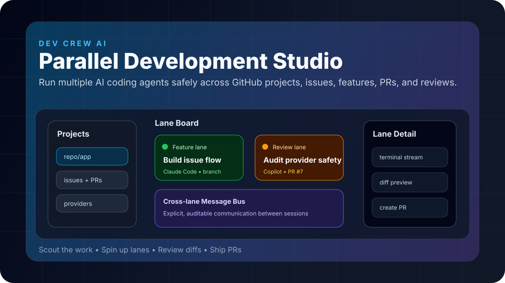
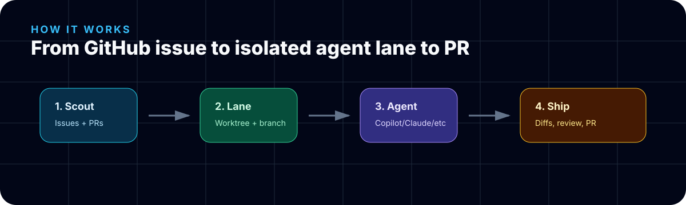

# Dev Crew AI

**Parallel Development Studio for AI coding agents.**

**By Ragnar Pitla and RBuild.ai.**

Dev Crew AI is a local-first desktop app for Windows and macOS that lets you run multiple AI coding sessions safely across GitHub projects, local Git repos, and plain folders.

Bring your own agent: GitHub Copilot, Claude Code, Codex, OpenCode, Aider, Ollama, Hermes, or any custom command.

> Views expressed in this project are Ragnar Pitla's own and do not represent Microsoft's official position.



## We are building this now

Dev Crew AI is early and being built in public by **Ragnar Pitla and RBuild.ai**. The goal is to make a local-first product where developers can open multiple AI agents in their own terminal boxes, keep each task isolated, and still coordinate the work clearly.

The latest UX direction is a **multi-terminal agent workspace**:

- left side: project selector and mission control;
- center: terminal panes, one per agent lane;
- right side: pane controls and message bus;
- simple buttons to add a pane and move the focused pane left, right, top, or bottom.

Interactive mockup:

[Open the terminal workspace mockup](artifacts/dev-crew-ai-terminal-workspace-mockup.html)

## Why

One repo, one branch, one terminal, one AI session is sequential hell.

Dev Crew AI turns work into visible **lanes**:

- each lane gets a git worktree when Git is available;
- each lane gets a branch;
- each lane gets scoped instructions;
- each lane runs an agent/provider process;
- each lane can create a PR when GitHub is connected;
- lanes coordinate through an auditable message bus.

## Local-first project modes

Dev Crew AI should work even before a project is on GitHub.

1. **GitHub repo** — use issues, PRs, branches, and CI.
2. **Local Git repo** — use local branches, worktrees, diffs, and commits.
3. **Plain folder** — initialize local Git so agent changes are trackable and reversible.

GitHub is optional until the user wants issues and PRs.

## How it works



1. **Scout** GitHub issues, PRs, local repo state, or a plain folder.
2. **Spin up a lane** with its own worktree/branch/instructions when Git is available.
3. **Run an agent** using Copilot, Claude Code, Ollama, Hermes, or a custom command.
4. **Review and ship** with visible diffs, message bus coordination, commits, and PR creation.

## What it does

- Add GitHub repos, local Git repos, or plain folders as projects.
- Read issues and PRs through `gh` CLI when GitHub is connected.
- Initialize local Git for plain folders so agent work is reversible.
- Create isolated lanes from issues, manual tasks, features, bugfixes, reviews, docs, releases, or spikes.
- Start agent sessions in terminal panes.
- Show lane status, terminal output, branch, worktree, provider, and linked GitHub work.
- Provide a visible cross-lane message bus so sessions can coordinate clearly.
- Detect future file conflicts across lanes.
- Create PRs and clean up worktrees when GitHub is connected.

## Product positioning

**Dev Crew AI** is the brand.

**RBuild.ai** is the company behind the project.

**Ragnar Pitla** is the creator/founder.

**Parallel Development Studio** is the descriptive phrase.

Tagline:

> Scout the work. Spin up lanes. Review diffs. Ship PRs.

## Marketing materials

Starter launch and messaging materials are in [docs/marketing](docs/marketing/):

- [Launch brief](docs/marketing/launch-brief.md)
- [Landing page copy](docs/marketing/landing-page-copy.md)
- [Social posts](docs/marketing/social-posts.md)
- [Press kit](docs/marketing/press-kit.md)
- [Project Vision](docs/product/project-vision.md)
- [OBO — On Your Behalf](docs/product/obo.md)

## Status

Early open-source scaffold. The repo includes:

- Electron + React + TypeScript app shell;
- lane data model;
- Git service;
- GitHub CLI service;
- local-first project scan foundation;
- Project Vision detection for lane instructions;
- provider adapter interface;
- Claude Code, Copilot, Ollama, and custom-command provider presets;
- lane orchestration service;
- demo UI for lane board, lane detail, onboarding, and message bus;
- interactive terminal workspace mockup;
- docs and templates;
- starter marketing materials;
- GitHub CLI/Copilot workflow guide;
- Action Gates model/service foundation for PM → Dev → QA → PM Final approval before GitHub push.

## Quickstart

```bash
git clone https://github.com/RagnarPitla/dev-crew-ai.git
cd dev-crew-ai
npm install
npm run dev
```

## Requirements

- Node.js 20+
- Git
- Optional: GitHub CLI (`gh`) authenticated for GitHub workflows
- Optional provider CLIs:
  - Claude Code: `claude`
  - GitHub Copilot CLI or `gh copilot`
  - Ollama: `ollama`
  - any custom command

## Safety model

Dev Crew AI is local-first and visible-by-default:

- no automatic merge;
- no automatic force push;
- no hidden cross-agent context sharing;
- every lane is isolated by git worktree when Git is available;
- plain folders can initialize local Git before agent edits;
- dangerous cleanup actions require user intent;
- provider commands are visible and configurable.

## Roadmap

See [docs/roadmap.md](docs/roadmap.md).

## License

MIT © 2026 Ragnar Pitla and RBuild.ai
